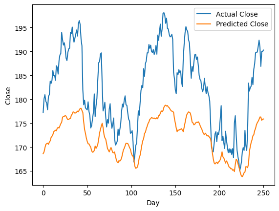

# LSTM-Forecast-Torch



## Overview

LSTM-Forecast-Torch is a production-ready time series forecasting application built with PyTorch that implements Long Short-Term Memory (LSTM) neural networks for accurate stock market predictions. This project focuses on Apple stock data forecasting but can be extended to other time series forecasting tasks.

## Features

- **Modular Pipeline Architecture**: Well-organized, component-based design following MLOps best practices
- **LSTM Model Implementation**: Leverages PyTorch for building and training LSTM models
- **Data Processing Pipeline**: Complete data ingestion, validation, cleaning, and preparation steps
- **Model Training & Evaluation**: End-to-end workflow from training to evaluation
- **Web Application Interface**: Flask-based interface for making predictions
- **Experiment Tracking**: MLflow integration for experiment tracking and model versioning
- **Containerization Support**: Dockerfile for easy deployment

## Tech Stack

- **Deep Learning Framework**: PyTorch
- **Machine Learning**: scikit-learn, pandas, numpy
- **Web Framework**: Flask
- **Experiment Tracking**: MLflow
- **Visualization**: matplotlib, seaborn, plotly
- **Containerization**: Docker

## Project Structure

```
lstm-forecast-torch/
├── .github/                  # GitHub workflows and actions
├── config/                   # Configuration files
├── data/                     # Data storage
├── logs/                     # Application logs
├── mlruns/                   # MLflow experiment tracking
├── notebooks/                # Jupyter notebooks for research
├── research/                 # Research code and experiments
├── src/                      # Source code
│   └── TimeSeriesForecast/   # Main package
│       ├── components/       # Pipeline components
│       ├── config/           # Configuration management
│       ├── constants/        # Constants and paths
│       ├── entity/           # Data entities and models
│       ├── pipeline/         # Processing pipelines
│       └── utils/            # Utility functions
├── templates/                # Flask templates
├── app.py                    # Flask application
├── main.py                   # Main execution script
├── params.yaml               # Model parameters
├── schema.yaml               # Data schema
└── setup.py                  # Package setup
```

## Installation

### Prerequisites

- Python 3.8+
- pip
- Virtual environment (recommended)

### Setup

1. Clone the repository:
   ```bash
   git clone https://github.com/carlosgutierrezch/lstm-forecast-torch.git
   cd lstm-forecast-torch
   ```

2. Create and activate a virtual environment:
   ```bash
   python -m venv venv
   source venv/bin/activate  # On Windows: venv\Scripts\activate
   ```

3. Install dependencies:
   ```bash
   pip install -r requirements.txt
   ```

4. Install the package in development mode:
   ```bash
   pip install -e .
   ```

## Usage

### Running the Pipeline

Execute the complete pipeline with:

```bash
python main.py
```

This will run the following stages sequentially:
1. Data Ingestion
2. Data Validation
3. Data Cleaning
4. Data Preparation
5. Model Training
6. Model Evaluation

### Model Configuration

Adjust model parameters in `params.yaml`:

```yaml
TorchModel:
  n_steps: 1
  split_ratio: 0.80
  seed: 42
  batch_size: 10
  drop_out_rate: 0.05
  input_size: 1
  hidden_size: 4
  num_stacked_layers: 1
  learning_rate: 0.001
  num_epochs: 10
```

### Data Schema

Data should follow the schema defined in `schema.yaml`:

```yaml
COLUMNS:
  Date: object
  Close/Last: object
  Volume: int64
  Open: object
  High: object
  Low: object
```

### Web Application

Start the Flask web application:

```bash
python app.py
```

Access the application at http://localhost:5000.

## Docker Deployment

Build and run the Docker container:

```bash
docker build -t lstm-forecast-torch .
docker run -p 5000:5000 lstm-forecast-torch
```

## Development Workflow

1. Update config.yaml
2. Update schema.yaml
3. Update params.yaml
4. Update the entity
5. Update the configuration manager in src/config
6. Update the components
7. Update the pipeline
8. Update main.py

## LSTM Model Architecture

The project implements an LSTM model with the following architecture:
- Input size: Configurable (default: 1)
- Hidden size: Configurable (default: 4)
- Number of stacked layers: Configurable (default: 1)
- Dropout rate: Configurable (default: 0.05)

The model uses Adam optimizer and Mean Squared Error (MSE) loss function.

## License

This project is licensed under the MIT License - see the LICENSE file for details.

## Author

- **AETNA-68** - [GitHub](https://github.com/AETNA-68)

## Acknowledgments

- PyTorch team for the deep learning framework
- Open-source community for the various libraries used